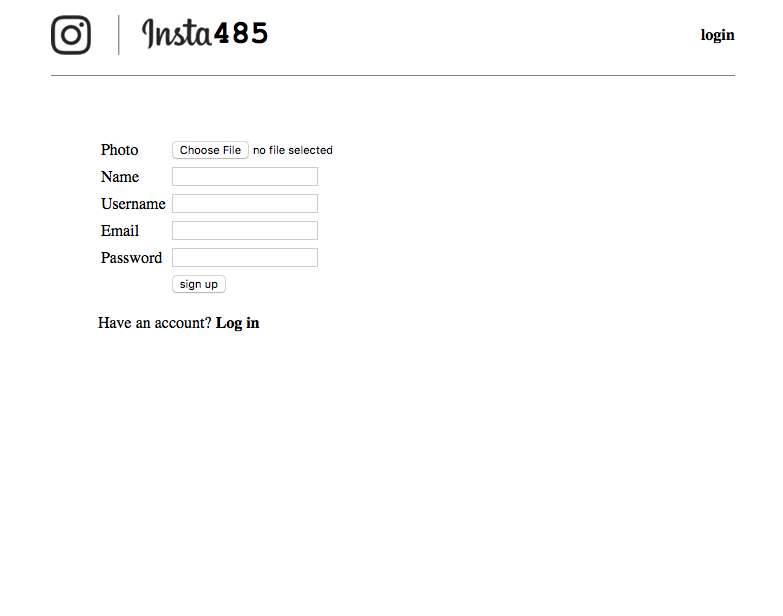
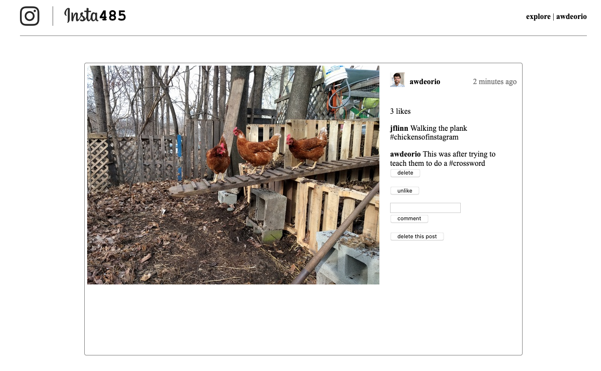

## Server Side Dynamic Pages

An Instagram clone implemented with server-side dynamic pages. 

In this project, we build an interactive website using server-side dynamic pages. Reuse the templates from project 1, rendering them on-demand when a user loads a page. New features include creating, updating, and deleting users, posts, comments, and likes.

The learning goals of this project include server-side dynamic pages, CRUD (Create, Read, Update, Delete), sessions, and basic SQL database usage.

### Schema

Update schema.sql, which will create 5 tables: users, posts, following, comments and likes. The following list describes the tables and columns:

> Users table
>> username, at most 20 chars, primary key  
>> fullname, at most 40 chars  
>> email, at most 40 chars  
>> filename, at most 64 chars  
>> password, at most 256 chars  
>> created, DATETIME type, automatically set by SQL engine to current date/time.  

> Posts table
>> postid, integer, primary key  
>> filename, at most 64 chars  
>> owner, at most 20 chars, foreign key to users  
>> created, DATETIME type, automatically set by SQL engine to current date/time.  
>> NOTE: rows are automatically removed and updated (read about CASCADE).   

> Following table
>> username1, at most 20 chars, foreign key to users  
>> username2, at most 20 chars, foreign key to users  
>> The tuple (username1, username2) form a primary key  
>> created, DATETIME type, automatically set by SQL engine to current date/time.  
>> NOTE: rows are automatically removed and updated (read about CASCADE).  

> Comments table
>> commentid, integer, primary key  
>> owner, at most 20 chars, foreign key to users table  
>> postid, integer, foreign key to posts table  
>> text, at most 1024 chars  
>> created, DATETIME type, automatically set by SQL engine to current date/time.  
>> NOTE: rows are automatically removed and updated (read about CASCADE).  

> Likes table
>> owner, at most 20 chars, foreign key to users  
>> postid, integer, foreign key to posts  
>> created, DATETIME type, automatically set by SQL engine to current date/time.  
>> The tuple (owner, postid) form a primary key  
>> NOTE: rows are automatically removed and updated (read about CASCADE).  

To clarify for the following table, username1 follows username2.  

### URLs

> /   
> /u/<user_url_slug>/   
> /u/<user_url_slug>/followers/   
> /u/<user_url_slug>/following/   
> /p/<postid_url_slug>/   
> /explore/   
> /accounts/login/   
> /accounts/logout/ Immediately redirects to /accounts/login/  
> /accounts/create/   
> /accounts/delete/   
> /accounts/edit/   
> /accounts/password/   

#### Screenshots

